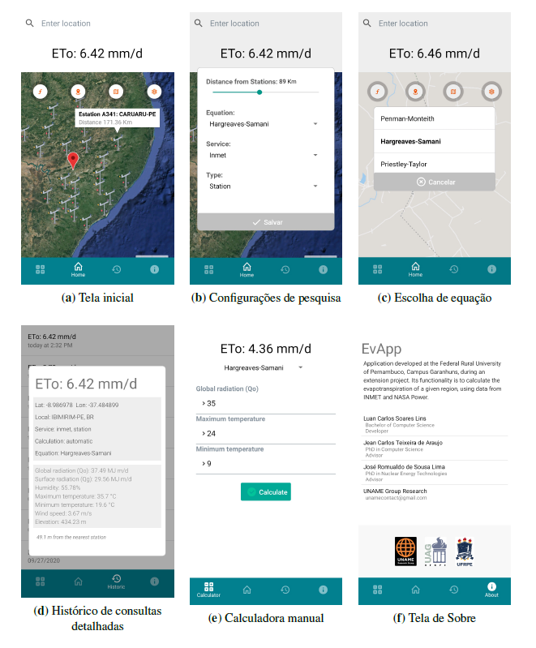

# EvApp

EvApp é um aplicativo desenvolvido em react-native para o cálculo e estimativa da ETo (evapotranspiração de referência) para um determinado local, usando os dados de clima obtidos da [API SIA](https://github.com/luancsl/SIA) e tem como público alvo técnicos agrônomos e estudiosos das agrarias e áreas afins. Por sua natureza personalizável, permite a usuários mais técnicos a configuração de parâmetros desejáveis ao cálculo, podendo estes, avaliar melhores métodos e provedor de dados adequado para o local. Além disso, compara-los com dados de clima medidos de forma não convencional, por fora da aplicação através da calculadora manual disponível para eventuais análises.
 
O aplicativo EvApp usa dados em tempo real de estações de superfície e serviço em grade NASA-POWER com métodos de cálculo da ETo como Penman-Monteith, Hargreaves-Saman, Priestley-Taylor e outros para estimar a evapotranspiração de referência em situações adversas mantendo um nível de precisão adequado para cada situação. O aplicativo exige do usuário utilizador apenas as coordenadas geográficas do local desejado que são passadas automaticamente caso o GPS do smartphone estiver ligado.

Entre as principais funções, estão:
1. Cálculo da ETo automático pelas coordenadas geográficas do GPS do aparelho;
2. Calculadora manual da ETo com seleção de método;
3. Visualização de estações de superfície próximas dentro de um raio de distância
configurável pelo usuário;
4. Histórico de pesquisa detalhado com dados sobre os elementos usados para estimar
ETo, o método de cálculo, os dados da estação promovida, a localização e sua
distância para o usuário;

